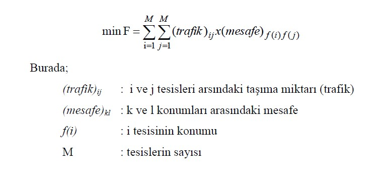
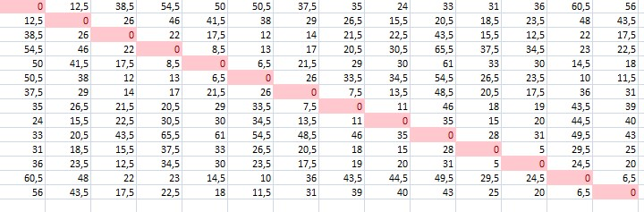
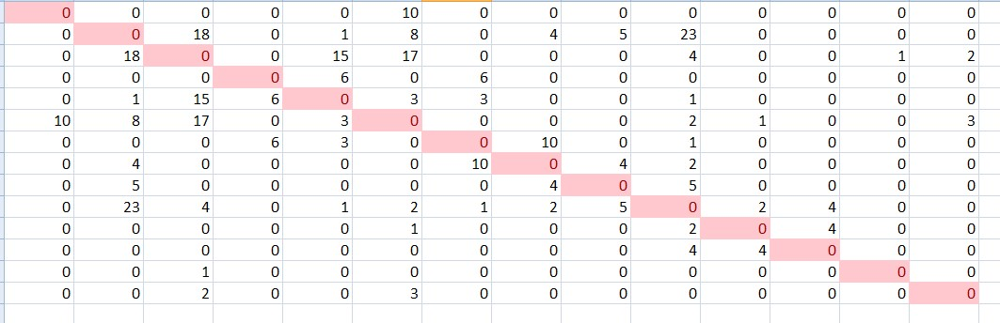
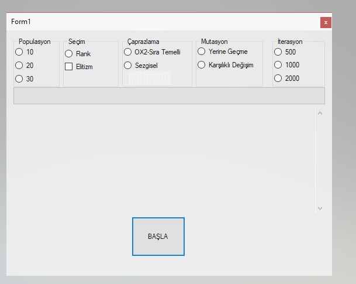

# Genetik Algoritmalar
Genetik Algoritmalar yardımıyla iş atölye yerleşimi
Yüksek lisans egitimim sırasında genetik algoritmalar konusunda yazdığım program:

Program ilgili deşişkenleri bin/debug konumunda bulunan excell sayfasından alarak popülasyon üretir. Ardından seçim-çaprazlama-mutasyon döngüsünde belli bir iterasyonda en uygun maliyeti(bu problemde önceden hesaplanan en az 3111.0)  bulmaya çalışır.  

Program C# ile .Net ortamında hazırlandı:

Popülasyonlar: 10,20,30

Seçim Algoritmaları: Rank, Elitizm

Çaprazlama Algoritmaları: OX2 (Sıra Temelli) ve Heuristic(Sezgisel)  (P=0.5)

Mutasyon Algoritmaları: Displacement(Yerine Geçme) ,Reciprocal Exchange(Karşılıklı Değişim) (P=0.01)

İterasyonlar: 500,100,2000

### Problem: İstasyonlar hangi konumda yerleştirmeli ki gerçekleştirilen toplam taşıma mesafesi en az olsun.
 
 
 Taşıma mesafesi en az için:

  

 

Makineler Arası Mesafe: (Tablo simetrik :) )

Makineler Arası Taşıma Miktarı: (Tablo simetrik :) )

### Koşullar:
Makinelerden ilk 4 tanesi yer değiştirmeyecek. Bu arada konumları değişen makinelerin uzaklığıda değişecek.

### İşte Program Arayüzü

